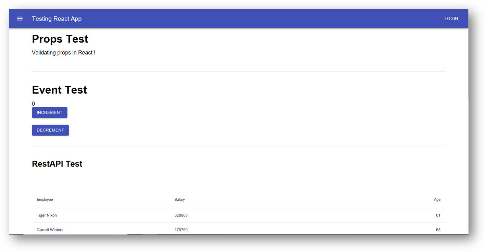

# React Unit Test using Jest and Enzyme

<p align="center">
  
</p>

## Installation

```bash
# Package Installation
npm install

# Run the Project
npm start

# Project Test
npm test

# Generate Code Coverage Report
npm run test -- --coverage --watchAll=false
```

<div align="right">
    <b><a href="#react-unit-test-using-jest-and-enzyme">↥ back to top</a></b>
</div>

## Project Covers

- Component Testing
- Props Testing
- Snapshot Testing
- Event Testing
- Mocking function
- Rest API Testing

<div align="right">
    <b><a href="#react-unit-test-using-jest-and-enzyme">↥ back to top</a></b>
</div>

## Folder Structure

```js
 + src
   + components
     + Events
	   + __snapshots__
	   - Events.js  
	   - Events.test.js
	 + Header
	   - Header.js
	   - Header.test.js
	 + Props
	   - Props.js
	   - Props.test.js
	 + RestAPI
	   - RestAPI.js
	   - RestAPI.test.js
   + __mocks__
     - axios.js
```

<div align="right">
    <b><a href="#react-unit-test-using-jest-and-enzyme">↥ back to top</a></b>
</div>

## Code Coverage Report

```js
|File                    |  % Stmts | % Branch |  % Funcs |  % Lines | Uncovered Line #s |
|------------------------|----------|----------|----------|----------|-------------------|
|All files               |    88.89 |        0 |       75 |    88.24 |                   |
| src                    |      100 |      100 |      100 |      100 |                   |
|  App.js                |      100 |      100 |      100 |      100 |                   |
| src/Components/Events  |       50 |        0 |    33.33 |       50 |                   |
|  Events.js             |       50 |        0 |    33.33 |       50 |             14,16 |
| src/Components/Header  |      100 |      100 |      100 |      100 |                   |
|  Header.js             |      100 |      100 |      100 |      100 |                   |
| src/Components/Props   |      100 |      100 |      100 |      100 |                   |
|  Props.js              |      100 |      100 |      100 |      100 |                   |
| src/Components/RestAPI |      100 |      100 |       80 |      100 |                   |
|  RestAPI.js            |      100 |      100 |       80 |      100 |                   |
|------------------------|----------|----------|----------|----------|-------------------|
```

<div align="right">
    <b><a href="#react-unit-test-using-jest-and-enzyme">↥ back to top</a></b>
</div>

## Technology

- [React](https://create-react-app.dev/docs/getting-started/)
- [Jest](https://jestjs.io/docs/en/getting-started.html)
- [Enzyme](https://enzymejs.github.io/enzyme/docs/installation/react-16.html)
- [Material-UI](https://material-ui.com/getting-started/installation/)
- [Axios](https://github.com/axios/axios)
- [React Testing Library](https://reactjs.org/docs/testing-recipes.html)

<div align="right">
    <b><a href="#react-unit-test-using-jest-and-enzyme">↥ back to top</a></b>
</div>
