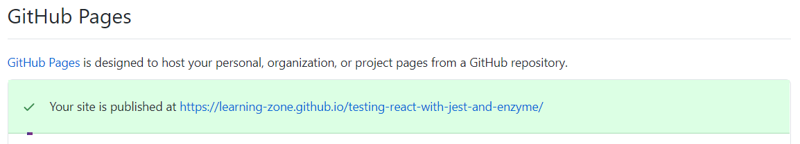

# React Unit Test using Jest and Enzyme


## Installation

```bash
# Package Installation
npm install

# Run the Project
npm start

# Project Test
npm test

# Generate Code Coverage Report
npm run test -- --coverage --watchAll=false
```

## Project Covers

- Component Testing
- Props Testing
- Snapshot Testing
- Event Testing
- Mocking function
- Rest API Testing

## Folder Structure

```js
 + src
   + components
     + Events
	   + __snapshots__
	   - Events.js  
	   - Events.test.js
	 + Header
	   - Header.js
	   - Header.test.js
	 + Props
	   - Props.js
	   - Props.test.js
	 + RestAPI
	   - RestAPI.js
	   - RestAPI.test.js
   + __mocks__
     - axios.js
```

## Code Coverage Report

```js
|File                    |  % Stmts | % Branch |  % Funcs |  % Lines | Uncovered Line #s |
|------------------------|----------|----------|----------|----------|-------------------|
|All files               |    88.89 |        0 |       75 |    88.24 |                   |
| src                    |      100 |      100 |      100 |      100 |                   |
|  App.js                |      100 |      100 |      100 |      100 |                   |
| src/Components/Events  |       50 |        0 |    33.33 |       50 |                   |
|  Events.js             |       50 |        0 |    33.33 |       50 |             14,16 |
| src/Components/Header  |      100 |      100 |      100 |      100 |                   |
|  Header.js             |      100 |      100 |      100 |      100 |                   |
| src/Components/Props   |      100 |      100 |      100 |      100 |                   |
|  Props.js              |      100 |      100 |      100 |      100 |                   |
| src/Components/RestAPI |      100 |      100 |       80 |      100 |                   |
|  RestAPI.js            |      100 |      100 |       80 |      100 |                   |
|------------------------|----------|----------|----------|----------|-------------------|
```

## Deploy React App to GitHub Pages

**Step 01: Install GitHub Pages package as a dev-dependency**

```bash
# Install Github Pages into repository
npm install gh-pages --save-dev
```

**Step 02: Add properties to `package.json` file**

The first property we need to add at the top level `homepage` second we will define this as a string and the value will be `http://{username}.github.io/{repo-name}` {username} is your GitHub username, and {repo-name} is the name of the GitHub repository you created it will look like this:

```bash
"homepage": "http://learning-zone.github.io/react-unit-test"
```

Second in the existing scripts property we to need to add predeploy and deploy.

```bash
"scripts": {
//...
"predeploy": "npm run build",
"deploy": "gh-pages -d build"
}
```

**Step 03: Create a Github repository and initialize it**

Now, create a remote GitHub repository with your app name and go back initialize this `git init` add it as remote `git remote add origin git@github.com:learning-zone/react-unit-test.git`

**Step 04: Deploy to GitHub Pages**

```bash
npm run deploy
```

this command will create a branch named gh-pages this branch host your app, and homepage property you created in package.json file hold your link for a live preview, or you can open the **Repository >> Settings** scroll down to **GitHub Pages** section you will find this:



## Technology

- [React](https://create-react-app.dev/docs/getting-started/)
- [Jest](https://jestjs.io/docs/en/getting-started.html)
- [Enzyme](https://enzymejs.github.io/enzyme/docs/installation/react-16.html)
- [Material-UI](https://material-ui.com/getting-started/installation/)
- [Axios](https://github.com/axios/axios)
- [React Testing Library](https://reactjs.org/docs/testing-recipes.html)
